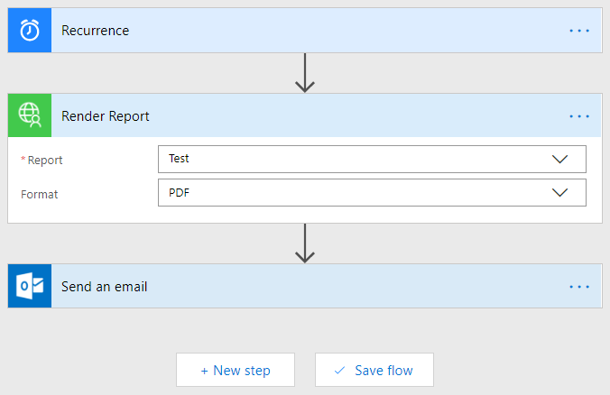

# Report Renderer

## Overview
Out of the box, Dynamics 365 does not provide a method to schedule reports.  This solution changes that.

Using this solution, you can create flows like this:  

Available Formats: PDF, CSV, XML, Word, Excel, HTML 5.

## Configuration
Please refer to the [installation](./docs/INSTALL.md) and [usage](./docs/USAGE.md) documentation.