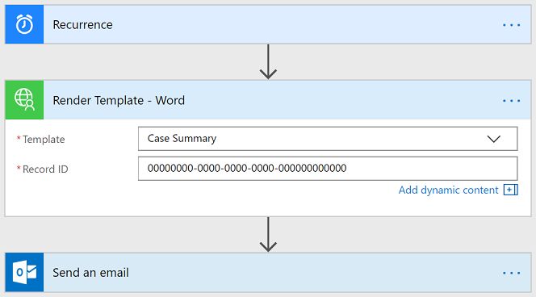
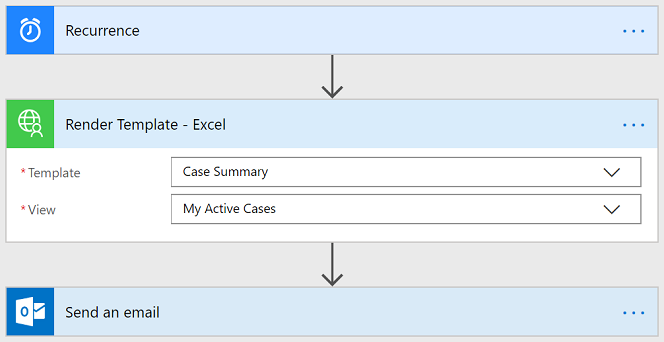

# Report Renderer

## Archived

This solution is no longer the recommended approach.  Please use a Power BI Premium (per user or per capacity) license to create a Paginated Report connected to Dataverse which can be scheduled.  Please see these links for more information.

- https://docs.microsoft.com/en-us/power-bi/admin/service-premium-per-user-faq
- https://docs.microsoft.com/en-us/power-bi/paginated-reports/paginated-reports-data-sources
- https://docs.microsoft.com/en-us/power-bi/consumer/paginated-reports-subscriptions

-----

## Overview
Out of the box, Dynamics 365 does not provide a method to schedule reports.

This solution installs a Report Renderer plugin in your environment which allows you to render any report (SSRS) or document template (Word or Excel).  Using this, you can create flows to email reports/documents on a recurring basis.
### Render Report

   

Available Formats: PDF, CSV, XML, Word, Excel, HTML 5.

### Render Template - Word

   

### Render Template - Excel

   

## Configuration
Please refer to the [installation](./docs/INSTALL.md) and [usage](./docs/USAGE.md) documentation.

## Parameters
In order for the reports to render successfully, you must pass in the proper parameters (if the report requires them).  If you pass in invalid parameters, you will get an error.

Parameters are passed in as a JSON object where the keys are the parameter names.  If the report has default parameters defined, you do not need to pass in the parameters.

### Out-of-the-box Reports
These reports use FetchXML for the report parameters.  The parameter names generally follow a format of `CRM_Filtered{Entity}` where `{Entity}` is the "Logical Name" of the entity the report is based on.

Here's an example from the "User Summary" report. Note that the FetchXML has the quotes escaped.
```
{
  "CRM_FilteredSystemUser": "<fetch version=\"1.0\" output-format=\"xml-platform\" mapping=\"logical\" distinct=\"false\"><entity name=\"systemuser\"><all-attributes /></entity></fetch>"
}
```

### Report Wizard
These reports are effectively the same as the out-of-the-box reports.  See the previous section.

### Custom Reports
These are reports created through Visual Studio/BIDS.  Because they are custom, the parameters will depend on how the report author configured the report.  In the screenshot above, the "Weekly Report" has a custom parameter named "Color".
