# Installation
First, download the files from the [Releases](../../../releases).

## Dynamics 365
1. Go to Settings > Solutions, click Import.
 
2. Follow the prompts to import the `ReportRenderer_X_X_X_X_managed.zip` file.

3. After the solution is imported, open it up.

4. Go to the Configuration page, set the username/password, and click Submit.

   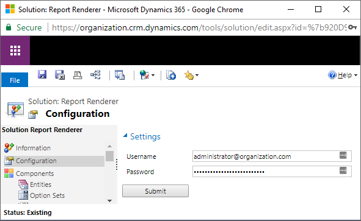

5. Open the `Render` process and activate it.

## Azure AD
1. Open Azure Active Directory from the [Azure Portal](https://portal.azure.com).

2. Open App registrations.

3. Click the link to add a new application registration.

   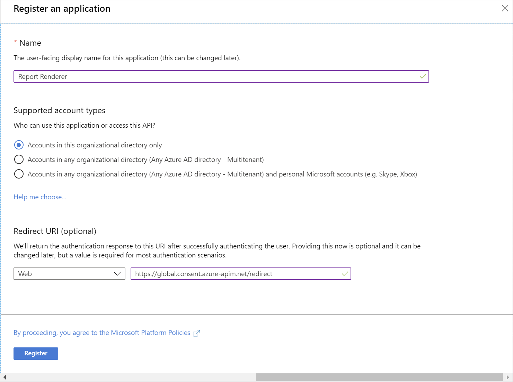

4. After the application registration is created, copy the Application ID.  You will use this as the Client ID.

5. Click Settings.

6. Click Reply URLs, add the appropriate one for your region, then click Save.

   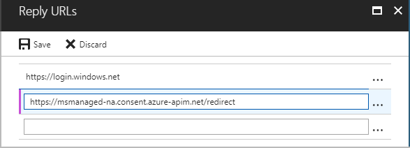

   | Region         | Reply URL                                             |
   | :------------- |:----------------------------------------------------- |
   | United States  | https://msmanaged-na.consent.azure-apim.net/redirect  |
   | Europe         | https://europe-001.consent.azure-apim.net             |
   | Asia           | https://asia-001.consent.azure-apim.net               |
   | Australia      | https://australia-001.consent.azure-apim.net          |
   | India          | https://india-001.consent.azure-apim.net              |
   | Japan          | https://japan-001.consent.azure-apim.net              |
   | Canada         | https://canada-001.consent.azure-apim.net             |
   | Brazil         | https://brazil-001.consent.azure-apim.net             |
   | United Kingdom | https://uk-001.consent.azure-apim.net                 |

   

7. Add a required permission for Dynamics CRM Online.  After choosing the delegated permission, click Select, and then click Done.

   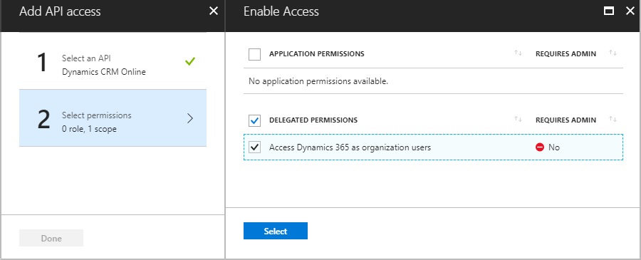

8. Add a new key. After saving, copy the generated Value.  You will use this as the Client Secret below.

   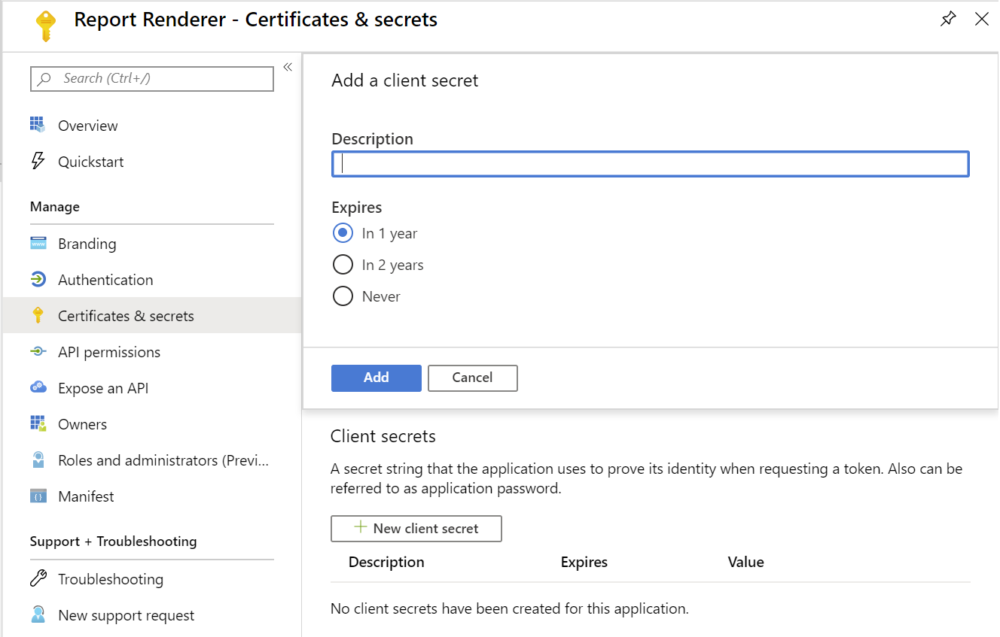

## Flow
1. Create the connector by importing the OpenAPI file.

   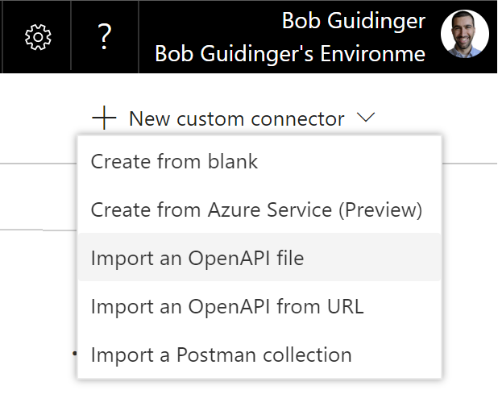
   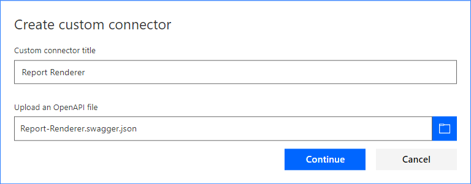

2. After the import, replace the Host with your Dynamics 365 host.

   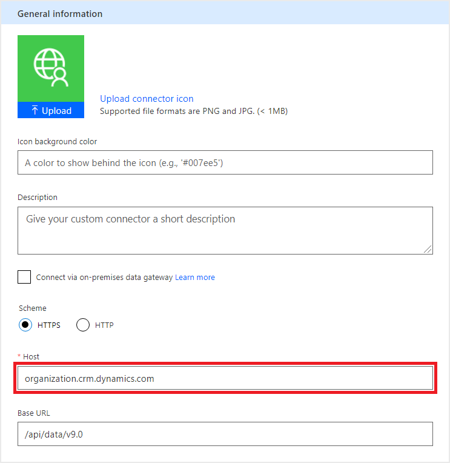

3. Next, configure Security.  Use the Client ID/Secret from the app registration above.  Also replace the Resource URL.

   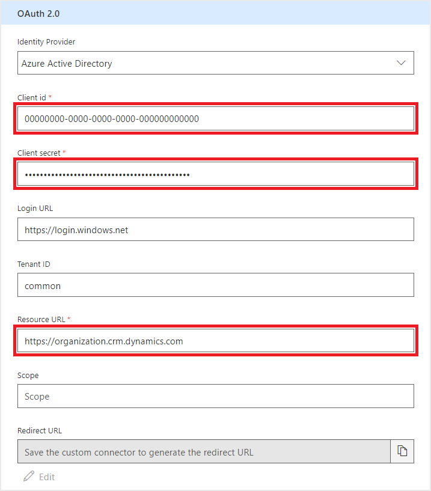

4. Click on the Test link, then click Create Connector.

5. Create a new connection.

   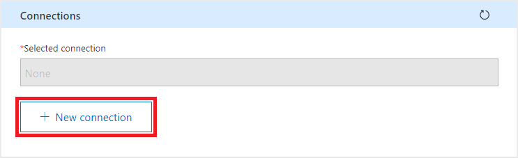

6. After logging in, you will be asked to consent to the permissions.

   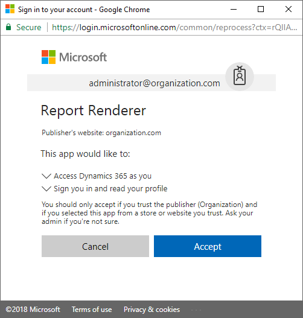

7. Finally, test the API call.  
   _You may get a 404 error.  Wait approximately 30 minutes and try again._