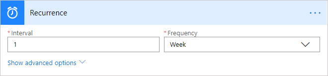
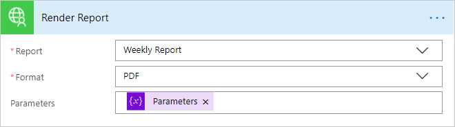
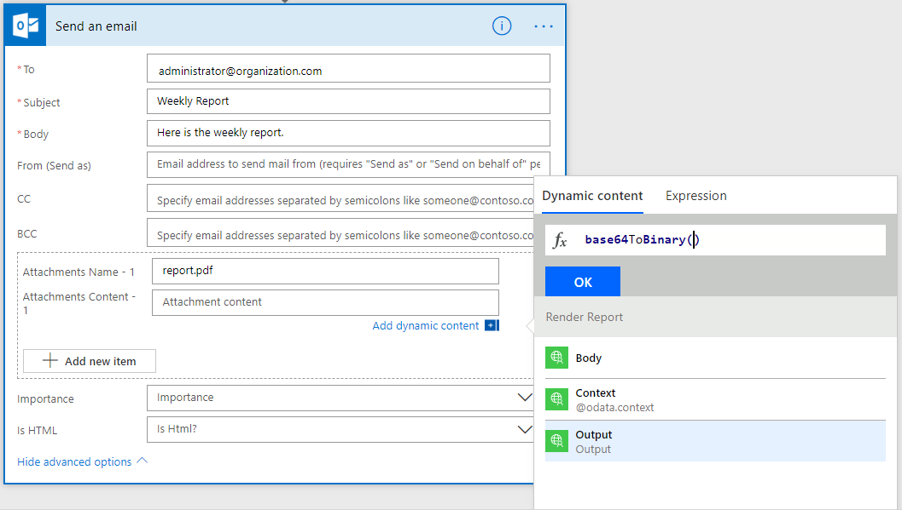

# Usage
There are two ways to use the Report Renderer.

## Flow
The action can be included in a flow.

1. Create a new blank flow.

2. Add a Schedule trigger.

   

3. Add an Initialize Variable action.  The keys must exactly match the names of the parameters on the report.

   


4. Add the Render Report action, select a report and select a report from the list.   You must convert the Parameters variable to a string using an expression of `string(variables('Parameters'))`.

   

5. Add a Send an Email action.

6. Under advanced options, add an attachment using the Output of the render action.

   

7. Save and test the flow.


## Dynamics 365
You can call the action/plugin directly through the Web API.
1. Create the request class.

   ```
   var Sdk = Sdk || {};

   Sdk.RenderReportRequest = function (report, format, parameters) {
     this.entity = {
       entityType: 'report',
       id: report
     };
     this.Format = format;
     this.Parameters = JSON.stringify(parameters);

     this.getMetadata = function () {
       return {
         boundParameter: 'entity',
         operationType: 0,
         operationName: "bg_Render",
         parameterTypes: {
           "entity": {
             "typeName": "Microsoft.Dynamics.CRM.report",
             "structuralProperty": 5
           },
           "Format": {
             "typeName": "Edm.String",
             "structuralProperty": 1
           },
           "Parameters": {
             "typeName": "Edm.String",
             "structuralProperty": 1
           }
         }
       };
     };
   };
   ```

2. Call it.  

   ```
   var report = '00000000-0000-0000-0000-000000000000';
   var format = 'PDF';
   var parameters = { Color: '#FF0000' };

   var request = new Sdk.RenderReportRequest(report, format, parameters);

   Xrm.WebApi.online.execute(request).then(result => {
       var response = JSON.parse(result.responseText);
       var output = response.Output;

       console.log(output);
   });
   ```